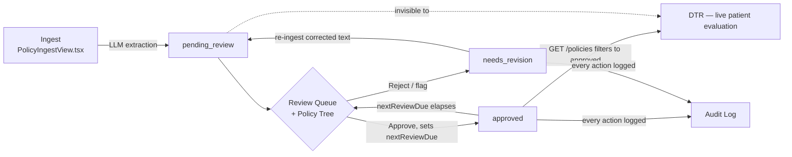

# Policy Logic Tree — Human-in-the-Loop Clinical Review

**Plan for a clinical-reviewer screen that visualizes how the Intelligent Policy Engine parsed a medical policy, with approve/reject gating before the policy governs live prior authorization decisions.**

Prepared for: PA-Standalone-SmartApp / CMS-0057-F Prior Authorization demo
Status: **Implemented** — backend, both new screens, and nav wiring are live. This document now describes the built system, not a proposal.

**Revision history:**
- Added a dedicated Audit Log screen (§3) and a review-cadence / "due for re-review" mechanism (§4) — policies change often enough in practice that approval can't be a one-time event.
- Added real **directory-based change detection** (§4): most payers publish policies as files in a directory and replace the file in place when the policy changes, rather than emitting any event an app could subscribe to. Since `policies/seeds/` already works this way, the review mechanism snapshots each approved policy's source file mtime and flags it the moment that file is replaced — a second, independent signal alongside the time-based cadence, and a genuinely detectable one rather than a guess.

---

## 1. The Gap This Closes

Today, ingestion and activation are the same event. The moment a policy is parsed by the LLM (`POST /ingest`, `/ingest/text`, or `/ingest/upload`), it is written to `policies/<policyId>.json` and is **immediately live** — `GET /policies` returns it, `policyLookup.findPolicyIdForCpt()` on the frontend matches CPT codes against it, and the next patient's DTR run will be evaluated against whatever the LLM extracted, sight unseen by a human.

There is no review step, no way to see *why* the engine decided a criterion means what it means, no gate preventing an unreviewed extraction from being used in a real coverage determination, and — the piece added in this revision — no record of who approved what and when, and no mechanism for noticing when an approved policy is old enough that it should be looked at again. Payer policies get revised on their own schedule, independent of whatever's cached locally; an approval from six months ago silently governing today's patients is its own kind of risk.

This plan adds three things: a **human-in-the-loop gate** (policies start `pending_review`, are invisible to DTR, and need explicit approval), an **audit log** (a permanent, queryable record of every review decision), and a **review-cadence mechanism** (every approval carries a "review again by" date, and the system surfaces it automatically once due — no separate monitoring process required).

---

## 2. What the Reviewer Actually Needs to See (Policy Logic Tree)

You described it as a "logic tree" that mimics the DTR screen. That's the right instinct — reviewers already know how to read that shape, and reusing it means no new visual language to learn. The DTR tree (`DtrTreeView.tsx`) shows, for one **patient**: policy → criteria groups → each group's met/gap status with the FHIR evidence found.

This screen shows the same shape for one **policy document**, before any patient is involved:

```
Bariatric Surgery (Surgical Treatment of Morbid Obesity)          [PENDING REVIEW]
Blue Cross Prior Authorization · CPT 43644, 43645, 43770–43775 · Effective 2026-01-01
Approval requires ALL required groups below (1 supportive, non-blocking)

├── Group 1 · Primary Obesity Diagnosis                              [REQUIRED]
│     Rule:  Condition.code IN {E66.01, E66.09, E66.1}  (ICD-10-CM)
│     Source: "...documented diagnosis of morbid (severe) obesity on the
│             problem list, confirmed by the treating physician..."
│     [Looks correct ✓]  [Flag for revision]
│
├── Group 2 · Body Mass Index (BMI) ≥ 35                              [REQUIRED]
│     Rule:  Observation.code = 39156-5 (LOINC), value >= 35
│     Source: "...documented BMI of 35 kg/m² or greater within the past
│             12 months..."
│     [Looks correct ✓]  [Flag for revision]
│
├── Group 3 · Qualifying Comorbidity                                  [REQUIRED]
│     Rule:  Condition.code IN {E11.9, I10, G47.33, ... } (13 codes, ICD-10-CM)
│     Source: "...at least one obesity-related comorbid condition
│             documented as an active diagnosis..."
│     [Looks correct ✓]  [Flag for revision]
│
└── Group 4 · Conservative Treatment Attempted (supportive)           [OPTIONAL]
      Rule:  Condition.code IN {Z71.3} (ICD-10-CM)
      Source: "...supervised medical weight management attempted for at
              least 6 months in the preceding 2 years..."
      [Looks correct ✓]  [Flag for revision]

Notes extracted: "Surgical readiness (age >= 18, psych eval, no active
substance use disorder) is required per policy but not derivable from
structured FHIR codes — verify via chart review."

Review cadence: 180 days after approval          [ Reject / Send back ]   [ Approve for use in DTR ]
```

Two things make this genuinely reviewable rather than just a display of the JSON:

- **The rule, in plain FHIR terms** — not raw JSON. "`Condition.code IN {...}` (ICD-10-CM)" instead of the nested `fhirQuery` object. This is the same translation `DtrTreeView` already does for patient results; here it's applied to the *rule* instead of a *match result*.
- **A source-text excerpt per group** — the actual sentence(s) from the original policy document that the LLM used to derive that criterion. This is what turns "trust the LLM" into "verify the LLM." It doesn't exist in today's schema and is the one genuinely new piece of extraction work (§5.2).

---

## 3. What the Audit Log Needs to Show

This is a separate, dedicated screen — not the same thing as the review tree above, and not the same as the review *queue* either (§6). Where the tree is "review this one policy right now" and the queue is "what's waiting for me," the audit log is **the permanent historical record**: every approval and rejection, ever, across every policy, queryable by anyone who needs to answer "who approved this, and when."

```
Audit Log                                          [Policy: All ▾] [Reviewer: All ▾] [Action: All ▾]  [Export CSV]

Policy #                      Policy Name                Payer               Action     Reviewer            Review Date          Next Review Due
─────────────────────────────────────────────────────────────────────────────────────────────────────────────────────────────────────────────────
lumbar-mri-72148               Lumbar Spine MRI Policy    Blue Cross PA        Approved   Dr. J. Aagaard      2026-01-12 14:20     2026-07-11  ⚠ OVERDUE
bariatric-surgery-cpt-43644    Bariatric Surgery Policy   Blue Cross PA        Approved   Dr. J. Aagaard      2026-01-15 10:32     2026-07-14  ✓ current
lumbar-mri-72148               Lumbar Spine MRI Policy    Blue Cross PA        Rejected   Dr. J. Aagaard      2026-01-10 09:05     —
knee-mri-73721                 Knee MRI Policy            Test Payer Co       Approved   Dr. J. Aagaard      2025-08-01 11:00     2026-01-28  ⚠ OVERDUE
```

Each row is one **review event** (an approval or a rejection), not one policy — so a policy that was rejected, corrected, and later approved shows its full history as multiple rows, in order. This is what "policy number, policy name, review date, and review approver" (your list) maps to directly, plus payer, action, and the computed next-review-due date from §4.

Columns: **Policy #** (`policyId`), **Policy Name** (`policyTitle`), **Payer**, **Action** (Approved / Rejected), **Reviewer**, **Review Date** (timestamp), **Next Review Due** (only meaningful on the row representing a policy's *current* approved state — see §4), plus the rejection **comment** visible on expand for rejected rows. Filterable by policy, reviewer, action, and date range; sortable by any column; CSV export for anyone who needs this outside the app (compliance reporting, spreadsheet review, etc.) — cheap to add since it's just serializing the same fetched rows client-side.

This is read-only. Nothing here is editable — it's a log, not a workflow tool. Approve/reject actions themselves only happen from the review tree (§2); this screen just shows what already happened.

---

## 4. Keeping Policies From Going Stale

Since policies "change periodically, frequently in fact," a one-time approval isn't enough. Two independent mechanisms handle this — one time-based, one a real detector of the payer actually changing the document.

**4.1 Review cadence (time-based).** Every approval carries a **review cadence** (default 180 days — a reasonable middle ground for payer policy revision cycles, configurable per-policy at approval time if a reviewer knows a specific payer updates more or less often). From that, the system computes a `nextReviewDue` date. Because this app is a request-driven service rather than a long-running daemon, "overdue" isn't something a background job has to compute and store — it's evaluated fresh on every request: `isOverdue = now > nextReviewDue`. Always accurate, zero scheduler infrastructure, can't drift out of sync.

**4.2 Source-file change detection (event-based, and real).** You pointed out that most payers actually store their published policies as files in a directory, and replace the file in place when the policy changes — that's exactly how `policies/seeds/` already works in this build: a seed or uploaded policy is a real file on disk with a real modification time. So this is now a genuinely detectable signal, not a guess: when a policy is approved, the engine snapshots its source file's mtime (`lastApprovedSourceMtime`). On every read, it re-checks the file's current mtime — if it has moved forward, the file was replaced with a newer version, and the policy is flagged `sourceChanged: true` and resurfaces in the review queue **immediately**, independent of the cadence timer. A policy ingested from pasted text (no backing file) has nothing to watch and falls back to cadence-only.

This means a reviewer doesn't have to wait out a 180-day window to notice a payer swapped in an updated PDF — replacing the file in `policies/seeds/` (which is exactly what happens today when someone drops a new version into that directory and re-runs ingest) is caught on the very next queue load.

Where this shows up:
- **Review Queue** (§6): overdue-but-still-approved policies *and* source-changed policies both appear here alongside genuinely new `pending_review` ones — from the reviewer's perspective, all three are "needs my attention," just with different reasons (surfaced as distinct badges).
- **Audit Log** (§3): the current-state row for each policy shows its due date and an overdue flag if applicable; source-change state is visible on the policy detail screen.
- **Ingest Policy screen**: every ingested policy's list entry now shows a live status badge (Approved / Pending Review / Needs Revision / Overdue / Source Changed), so this is visible without having to go looking.

**What this doesn't cover:** the engine only sees files that land in its own `policies/seeds/` directory — it has no network connection to a payer's actual published policy site, so it can't notice a change out on the payer's own servers until the updated document is actually saved into that directory (via upload or manual drop). That's a real, honest limitation, not a corner cut: closing it fully would mean either a payer providing a real feed/API of policy updates (uncommon), or a scraper/sync job pointed at a specific payer's site (fragile, payer-specific, and out of scope for this demo). Given the built-in cadence as a backstop, this is a reasonable line to draw for now — worth revisiting if a specific payer's policies turn out to be reachable by URL. If proactive notification (an email/Slack alert the moment something goes stale, rather than a badge visible next time someone opens the app) becomes useful, a Cowork scheduled task that periodically checks `GET /audit-log` / `GET /policies/review-queue` and flags anything overdue is a real, available option worth considering then.

---

## 5. Where This Sits in the Existing Flow



`PolicyIngestView.tsx` (today's "Ingest a New Policy" screen, nav step 8) still does the LLM extraction — nothing changes there. What changes is what happens *after* extraction: instead of the policy being immediately usable, it lands in a review queue, and two new screens handle everything downstream of that — the **Review Queue + Policy Tree** (nav step 9, "Review Policy Logic") for taking action, and the **Audit Log** (nav step 10, "Audit Log") for the historical record. I'd also drop a "Review before it goes live →" button directly on the ingest screen's success panel so the natural path is ingest → review → approve, not ingest-then-hope-someone-checks-later.

---

## 6. Frontend: the Review Queue (landing view)

Before a reviewer can open the tree for a specific policy (§2), they need a list of what needs attention. This is `GET /policies/review-queue` (§7.3) rendered as a simple, scannable list — one row per policy, not per event (that's the audit log's job):

```
Review Queue                                                              4 need attention

⬤ Lumbar Spine MRI Policy            Blue Cross PA     PENDING REVIEW              [Review →]
⬤ Knee MRI Policy                    Test Payer Co     NEEDS REVISION (see notes)  [Review →]
⬤ Bariatric Surgery Policy           Blue Cross PA     APPROVED · OVERDUE (12d)    [Review →]
   COPD Home Oxygen Policy           Test Payer Co     APPROVED · current          [Review →]
```

Clicking a row opens that policy's tree view (§2). This list is what makes the due-date mechanism in §4 actually actionable rather than just a badge nobody sees — it's the one place a reviewer can go to see everything that currently needs a decision, regardless of whether that's "brand new" or "coming up for renewal."

---

## 7. Data Model & Backend Changes

### 7.1 New fields on `PolicyDefinition` (persisted in `policies/<policyId>.json`)

| Field | Type | Purpose |
|---|---|---|
| `status` | `"pending_review" \| "approved" \| "needs_revision"` | The HITL gate. Defaults to `pending_review` on every ingest, including re-ingest. |
| `sourcePolicyText` | `string` | The raw text the LLM extracted from (already available at ingest time — currently discarded after the call). Needed so the review screen can show excerpts in context. |
| `reviewCadenceDays` | `number` | Set at approval time (default 180, overridable). Used to compute `nextReviewDue`. |
| `sourceFile` | `string \| null` | Filename in `policies/seeds/` this text was read from (seed ingest or upload), or `null` for pasted-text ingestion. Powers the source-file-change detection in §4.2. |
| `lastApprovedSourceMtime` | `number \| null` | Snapshot of `sourceFile`'s filesystem mtime at the moment of the most recent approval. Compared against the file's *current* mtime on every read to detect the payer having replaced the file. |
| `reviewHistory` | `{ action: "approved" \| "rejected", reviewerName, comment, timestamp, reviewCadenceDays? }[]` | Full audit trail — every decision, who made it, when, and (for rejections) why. This is both what powers the review-tree's "prior cycles" panel *and* the sole source of truth for the Audit Log screen (§3) — no separate log store needed, it's derived from this array across all policies. |
| `criteriaGroups[].sourceExcerpt` | `string` | **New LLM extraction field** — the verbatim sentence(s) supporting that specific group. See §7.2. |

`nextReviewDue`, `isOverdue`, and `sourceChanged` are **not** stored — they're computed on every read (`nextReviewDue`/`isOverdue` from the most recent `"approved"` entry in `reviewHistory` + the current time; `sourceChanged` from comparing `lastApprovedSourceMtime` against the source file's live mtime). Storing any of these separately would risk them drifting out of sync with what they're derived from; computing them fresh means that can't happen. Policies ingested before this feature existed have no `status` field at all and default to `"approved"` so they keep working rather than silently disappearing from DTR.

`policyId`, `policyTitle`, `payer`, `effectiveDate`, `governedCptCodes`, `criteriaGroups[].{id,title,required,description,fhirQuery,candidateCodes,documentationRequired}` — all unchanged.

### 7.2 Extraction prompt change (`policy-ingestor.mjs`)

The `EXTRACTION_PROMPT` schema gains one field per criteria group:

```
"sourceExcerpt": "string — the exact sentence(s) from the source text, quoted
                   verbatim, that this criterion was derived from"
```

This is a same-call change — no second LLM pass, no added latency beyond a slightly longer response. It's the difference between the reviewer trusting the extraction blind versus being able to click a group and see the receipt for it.

### 7.3 Backend endpoints (`policy-engine/src/index.mjs`)

| Endpoint | Change |
|---|---|
| `GET /policies` | **Filters to `status: "approved"` only.** This is the actual gate — it's the endpoint `policyLookup.findPolicyIdForCpt()` calls, so anything not approved simply doesn't exist as far as DTR is concerned. |
| `GET /policies/status` | **New.** Every policy, any status, with computed review fields — used by the Ingest screen's policy list so a just-ingested, still-pending policy doesn't disappear from view. |
| `GET /policies/review-queue` | **New.** Returns every policy that's `pending_review`, `needs_revision`, `approved`-but-overdue, or `approved`-with-`sourceChanged` — the list behind §6. Each entry includes computed `isOverdue`/`nextReviewDue`/`sourceChanged`. |
| `GET /policies/:policyId` | Unchanged shape, but now includes `status`, `sourcePolicyText`, `sourceFile`, `reviewHistory`, computed `nextReviewDue`/`isOverdue`/`sourceChanged`, and per-group `sourceExcerpt`. |
| `POST /policies/:policyId/approve` | **New.** Body: `{ reviewerName, comment?, reviewCadenceDays? }` (cadence optional, defaults to the engine's configured default — `POLICY_REVIEW_CADENCE_DAYS`, 180 unless overridden). Sets `status: "approved"`, snapshots the source file's current mtime, appends to `reviewHistory`. |
| `POST /policies/:policyId/reject` | **New.** Body: `{ reviewerName, comment }` (comment required — a rejection without a reason isn't actionable). Sets `status: "needs_revision"`, appends to `reviewHistory`. |
| `GET /audit-log` | **New.** Flattens `reviewHistory` across every policy into one chronological, filterable event list — the data behind §3. Query params: `policyId`, `reviewerName`, `action`. |
| `POST /ingest`, `/ingest/text`, `/ingest/upload` | Unchanged calling convention, but every fresh extraction (not a cache hit) now writes `status: "pending_review"`, `sourceFile`, and `reviewHistory: []` (re-ingesting resets to `pending_review` — a corrected policy needs re-approval, it doesn't inherit the old approval or its due date). |

All review/staleness logic lives in a new `services/policy-engine/src/policy-review.mjs` module — `index.mjs` stays a thin routing layer over it, matching how `policy-ingestor.mjs` and `fhir-evaluator.mjs` are already factored out.

### 7.4 Frontend client (`src/lib/dtr/policyReview.ts`, new file)

Thin wrappers matching the existing `policyIngest.ts` / `policyLookup.ts` style: `fetchReviewQueue()`, `fetchPolicyStatusList()`, `fetchPolicyReviewDetail(policyId)`, `approvePolicy(policyId, reviewerName, comment?, reviewCadenceDays?)`, `rejectPolicy(policyId, reviewerName, comment)`, `fetchAuditLog(filters?)`.

---

## 8. Frontend Components

### 8.1 `PolicyReviewView.tsx` — one file, two internal views, matching how `DtrTreeView.tsx` already keeps `PolicyTree`/`GroupCard`/loading/error/empty states together rather than splitting into separate files:

- **`PolicyReviewQueueList`** (default landing view) — the list from §6. Each row is clickable and opens the detail view for that policy; a status/reason badge (Pending Review / Needs Revision / Source File Changed / Overdue) makes the reason obvious at a glance.
- **`PolicyReviewDetailPanel`** — the individual-policy tree from §2, opened by clicking a queue row (local component state, no routing needed). Built on the same visual pattern as `DtrTreeView.tsx`'s `PolicyTree`/`GroupCard`:
  - **Header**: policy title, payer, effective date, governed CPT codes, status badge (including OVERDUE/SOURCE CHANGED with the due date shown), and a collapsible full source-document-text viewer.
  - **Logic summary line**: "Approval requires all N required groups below (M supportive, non-blocking)" — makes the AND-of-required-groups logic explicit, matching the actual decision rule (`fhir-evaluator.mjs`: `allMet = groups.every(g => !g.required || g.status === "met")`).
  - **Tree body**: one card per criteria group — required/optional badge, the rule in plain terms (not raw JSON), candidate codes, the **source excerpt** (quoted, visually distinct — or an explicit amber warning when a group has none, e.g. policies ingested before this feature existed), and `documentationRequired` text.
  - **Per-group flag control**: a "Flag this group for revision" checkbox per card; any flags disable Approve and get folded into the rejection comment automatically.
  - **Review history panel**: collapsible, shows this policy's own prior approve/reject cycles with reviewer/date/comment.
  - **Footer actions**: Reject (comment required) / Approve (reviewer name defaults from `SmartContext`'s SMART launch identity, editable; review cadence defaults to the policy's current cadence or 180 days, editable).

### 8.2 `AuditLogView.tsx` — the table in §3. Sortable/filterable (policy, reviewer, action), CSV export, read-only.

### Nav wiring (implemented)

- `AppShell.tsx`: `{ view: "policyReview", label: "Review Policy Logic", step: 9 }` and `{ view: "auditLog", label: "Audit Log", step: 10 }`, registered in `VIEW_COMPONENT`.
- `usePaStore.ts`: added `reviewFocusPolicyId` + `goToPolicyReview(policyId)` — a one-shot deep link so a button can jump straight to a specific policy's detail view instead of always landing on the queue.
- `PolicyIngestView.tsx`: the "Parsed Policy Definition" success panel has a "Review before it goes live →" button wired to `goToPolicyReview`, plus an accurate status line (distinguishes a fresh `pending_review` extraction from a cache-hit that was already approved). The "Policies Currently Ingested" list now reads `GET /policies/status` (all policies, any status) instead of `GET /policies` (approved-only) — otherwise a just-ingested policy would vanish from that list the moment it's created — and every row is clickable straight into the review screen, with a status badge (Approved / Pending Review / Needs Revision / Overdue / Source Changed).

---

## 9. Phasing

**Phase 1 (MVP — implemented):**
- `status` field + `GET /policies` filtering
- `sourceExcerpt` extraction + `sourcePolicyText` persistence
- `PolicyReviewView.tsx` (queue + tree, approve/reject)
- `reviewCadenceDays` / computed `nextReviewDue` / overdue surfacing in the queue
- `sourceFile` / `lastApprovedSourceMtime` / computed `sourceChanged` — real directory-based staleness detection (§4.2)
- `AuditLogView.tsx` (table, filters, CSV export)
- Nav wiring + "Review before it goes live" handoff from the ingest screen

**Phase 2 (not built — revisit once Phase 1 is in use and you know what reviewers actually want):**
- Inline editing of a criterion (code list, required flag, valueComparison) before approving, rather than the only correction path being "reject → paste corrected text → re-ingest → re-review"
- Side-by-side full source document view with excerpt highlighting in place, instead of a quoted snippet + a separate raw-text toggle
- Multi-reviewer / second-signoff support if that's a real requirement for your use case
- Diff view between an original extraction and a corrected re-ingestion
- Proactive overdue/source-changed notifications (email/Slack/Cowork scheduled task) instead of an in-app badge
- A real feed/sync from a specific payer's published policy site, if one becomes available, feeding the same `sourceChanged` mechanism instead of requiring a manual file drop into `policies/seeds/`

I'd hold Phase 2 until real review sessions surface which of those actually matter — inline editing in particular is a meaningfully bigger UI (need validation on hand-edited FHIR codes, need to decide whether an edited-then-approved policy is flagged differently from an as-extracted-then-approved one for audit purposes).

---

## 10. Verification Plan (run, results below)

Consistent with how the rest of this build has been verified — against real code paths, not assumptions. All of the following were actually executed against a running instance of the Policy Engine (curl-driven, since no browser is available in this environment) plus a full-project `tsc --noEmit`:

1. **Ingest → invisible to DTR while pending.** Wrote a fresh extraction with `status: "pending_review"`; confirmed it does **not** appear in `GET /policies` (the DTR-visible list) and **does** appear in `GET /policies/review-queue`. ✅
2. **Legacy-policy backward compatibility.** The pre-existing `bariatric-surgery-cpt-43644` policy (ingested before this feature existed, no `status` field) defaults to `status: "approved"`, `needsAttention: false` — confirmed it keeps working without requiring a forced re-review, and `GET /policies/:policyId` returns it without error. ✅
3. **Approve → now DTR-visible, leaves the queue.** Approved with a 1-day cadence (short window, for testing); confirmed it now appears in `GET /policies` and no longer appears in `GET /policies/review-queue`. ✅
4. **Overdue detection.** Backdated the approval's `reviewHistory` timestamp past the 1-day cadence window; confirmed the policy reappears in `GET /policies/review-queue` with `isOverdue: true`, while remaining present in `GET /policies` (overdue ≠ revoked — DTR usability isn't interrupted). ✅
5. **Source-file-change detection (§4.2).** Touched the mtime of the policy's source file in `policies/seeds/` (simulating a replaced/updated payer document); confirmed `GET /policies/:policyId` immediately reports `sourceChanged: true`, independent of the cadence timer. ✅
6. **Reject requires a comment.** Attempted a reject with no `comment` — got a 400 with a clear error; retried with a comment — succeeded, `status` became `needs_revision`, and the policy was immediately excluded from `GET /policies` again. ✅
7. **Audit log.** `GET /audit-log?policyId=...` returned both the approve and reject events for the test policy, most-recent-first, with `isCurrent`/`isOverdue` computed correctly per row. ✅
8. **Full-project `tsc --noEmit`** on the whole `PA-Standalone-SmartApp` project (not just a scoped subset) — zero errors. ✅

Not yet exercised end-to-end: the actual `POST /ingest`/`/ingest/upload` → OpenAI extraction → `sourceExcerpt` path, since no `OPENAI_API_KEY` is configured in this working environment (same limitation as before this feature — the extraction call itself is unchanged code from what was already verified working). The `sourceFile` plumbing into that path was verified by code inspection and the syntax/type checks above.

---

## 11. Open Questions — Resolved Defaults

These were left open in the original plan; since you asked me to proceed with implementation, I built with the following defaults rather than blocking on answers. Flagging them so you can override any that don't fit:

1. **Reviewer identity** — defaults to the SMART launch context's display name (same value `AppShell.tsx` already shows in the header), editable per review. No separate reviewer login exists; if you need reviewers to be a distinct identity from the ordering provider context, that's a real gap worth a follow-up.
2. **Default review cadence** — 180 days, configurable per-approval and via the `POLICY_REVIEW_CADENCE_DAYS` environment variable for the engine-wide default. Easy to change if you have a specific number in mind.
3. **Overdue behavior** — overdue is a prompt, not a suspension: an overdue-but-approved policy stays fully usable by DTR until re-reviewed. This was the safer-for-continuity default (a missed review deadline doesn't block real patient workflows), but it's a real tradeoff — say the word if you'd rather it block instead.
4. **Scope of "policy"** — still one JSON file per `policyId`, single-document review (no diff-against-prior-version view). The full source text is viewable in the review screen, and prior review cycles are visible in the history panel, but there's no side-by-side diff. Left for Phase 2 (§9) unless it turns out to matter sooner.

---

*Implemented and verified against a live instance of the Policy Engine (§10). The two new screens — Review Policy Logic and Audit Log — are wired into the app's nav as steps 9 and 10.*
